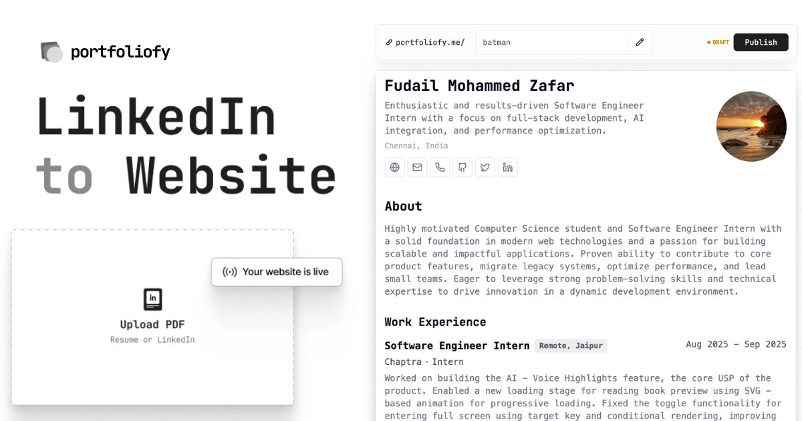

<a href="https://portfoliofy.me">
  
  <h1 align="center">Portfoliofy</h1>
</a>

  An open source personal site builder. Powered by Gemini.

## Tech stack

- Together.ai for the LLM
- Vercel's AI SDK as the LLM framework
- Clerk for authentication
- Next.js app router
- Upstash redis for my DB
- Vercel for hosting

## How it works

1. Create an account on the site with Google
2. Upload a PDF which gets uploaded to UploadThing
3. Send the PDF as context to Gemini to extract out relevant information with structured outputs (JSON mode)
4. Get all the information & put it on a dynamic route for the user to be able to view & publish their site

## Cloning & running

1. Fork or clone the repo
2. Create an account at [Upstash](https://upstash.com/) for the Redis DB
3. Create a `.env` (use the `.example.env` for reference) and replace the API keys
4. Run `pnpm install` and `pnpm run dev` to install dependencies and run locally

## Future tasks

- [ ] add error logging to make sure to fix any bugs
- [ ] add ability to get to the "preview" page if you have a site already
- [ ] ability to edit links in the site
- [ ] ability to edit any section in the site
- [ ] add themes that you can toggle on (start with ghibli)
- [ ] Delete previously uploaded resume when we upload a new one
